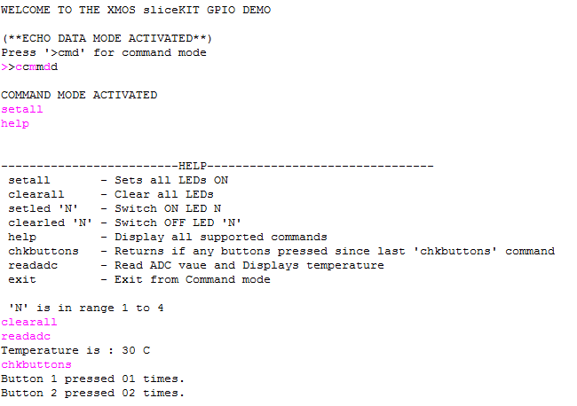

.. _Slicekit_GPIO_COM_port_Demo_Quickstart:

sw_gpio_examples COM Port demo : Quick Start Guide
--------------------------------------------------

We use the XA-SK-GPIO Slice Card together with the xSOFTip UART to create a UART , and send data to and from a PC COM port. 
Also xSOFTip I2C software component to communicate with on board ADC. 
This application showcases some of the key software features and serves as an example on how to use APIs of UART and I2C. 
This demo features UART data loop back, receives commands from comport, and perform according to the command input.

Install Demonstration Tools on the Host PC
++++++++++++++++++++++++++++++++++++++++++

The following tools should be installed on the host system in order to run this application

    * For Win 7: Hercules Setup Utility by HW-Group
      http://www.hw-group.com/products/hercules/index_en.html
    * For MAC users: SecureCRT7.0 
      http://www.vandyke.com/download/securecrt/
    * For Linux Users: Try cutecom (http://cutecom.sourceforge.net/) or try `sudo apt-get install cutecom`

Hardware Setup
++++++++++++++

The XP-SKC-L2 Slicekit Core board has four slots with edge conectors: ``SQUARE``, ``CIRCLE``,``TRIANGLE`` and ``STAR``. 

To setup up the system refer to the figure and instructions below 

   #. Connect XA-SK-GPIO Slice Card to the XP-SKC-L2 Slicekit Core board using the connector marked with the ``SQUARE``.
   #. Connect the XTAG Adapter to Slicekit Core board, and connect XTAG-2 to the adapter. 
   #. Connect the XTAG-2 to host PC. Note that a USB cable is not provided with the Slicekit starter kit.
   #. Switch on the power supply to the Slicekit Core board.
   #. Connect a null serial cable to DB-9 connector on XA-SK-GPIO Slice Card. The cable will need a cross over between the UART RX and TX pins at each end.
   #. Connect other end of cable to Host DB-9 connector slot. If the Host does not have an DB-9 Connector slot then use USB-UART cable for the demo. We used the BF-810 USB to Uart adapter (See http://www.bafo.com/products_bf-810_S.asp (Part number : BF-810). Any other usb to uart bridge should do just as well.
   #. Identify the serial (COM) port number provided by the Host or the USB to UART adapter and open a suitable terminal software for the selected serial port (refer to the Hercules or SecureCRT documentation above).
   #. Configure the host terminal console program as follows: 115200 baud, 8 bit character length, even parity, 1 stop bit, no hardware flow control. The Transmit End-of-Line character should be set to `CR` (other options presented will probably be `LF` and `CR\LF`).
   #. Connect XA-SK-GPIO Slice Card to the XP-SKC-L2 Slicekit Core board. 
   #. Connect the XTAG Adapter to Slicekit Core board, XA-SK-XTAG2 connector(xtag slice) and connect XTAG-2 to the adapter. 
   #. Connect the XTAG-2 to host PC.
   #. Switch on the power supply to the Slicekit Core board.
   #. Open the serial device on the host console program
   
.. figure:: images/hardware_setup.png
   :align: center

   Hardware Setup for GPIO COM Port Demo 

Import and Build the Application
++++++++++++++++++++++++++++++++

   #. Open xTimeComposer and check that it is operating in online mode. Open the edit perspective (Window->Open Perspective->XMOS Edit).
   #. Locate the ``'Slicekit COM Port GPIO Demo'`` item in the xSOFTip pane on the bottom left of the window and drag it into the Project Explorer window in the xTimeComposer. This will also cause the modules on which this application depends (in this case, module_i2c_master, module_uart_rx and module_uart_tx) to be imported as well. 
   #. Click on the Slicekit COM Port GPIO Demo item in the Explorer pane then click on the build icon (hammer) in xTimeComposer. Check the console window to verify that the application has built successfully.

For help in using xTimeComposer, try the xTimeComposer tutorial. FIXME - link?

Note that the Developer Column in the xTimeComposer on the right hand side of your screen provides information on the xSOFTip components you are using. Select the module_i2c_master component in the Project Explorer, and you will see its description together with API documentation. Having done this, click the `back` icon until you return to this quickstart guide within the Developer Column.
    

Usage of Software
+++++++++++++++++

   #. Open the XDE
   #. Choose *Run* |submenu| *Run Configurations*
   #. Double-click *XCore Application* to create a new configuration
   #. In the *Project* field, browse for `app_slicekit_com_demo`
   #. In the *C/C++ Application* field, browse for the compiled XE file
   #. Select the *XTAG-2* device in the `Target:` adapter list
   #. Click **Run**

Demo Application
+++++++++++++++++

   #. Look at the configured terminal client application console on the Host.
   #. The terminal displays the following message "WELCOME TO GPIO DEMO (**ECHO DATA MODE ACTIVATED**). In this mode any character typed in from the key board is echoed back. Verify this by typing characters in the terminal console on the host. The typed characters should be echoed back.
   #. When ready, enter command mode by typing ``>cmd`` (note, including the '>' character. The Console will then show  **COMMAND MODE ACTIVATED**.
   #. Type ``help`` in the console window. The help menu will be displayed as sown in the figure below.

   Screenshot of Hyperterminal window

   #. Type ``setall` in the console to switch ON all the LEDs.
   #. Type ``clearall`` to switch OFF all the LEDs.
   #. Type ``setled N`` for switching ON a particular LED. 'N' ranges from 1 to 4.
   #. Type ``clearled N`` for switching OFF a particular LED. 'N' ranges from 1 to 4.
   #. Type in ``chkbuttons`` to return the status of buttons since last 'chkbuttons' command. The console should display ``COMMAND EXECUTED NO BUTONS ARE PRESSED``.
   #. Press a button on the Slice Card. The console should display ``COMMAND EXECUTED BUTTON 1 PRESSED`` or ``COMMAND EXECUTED BUTTON 2 PRESSED``
   #. Type in ``chkbuttons`` again. The console should display ``COMMAND EXECUTED BUTTON 1 PRESSED``.
   #. Type in ``readadc`` for readig ADC value and displaying current temperature. The console should display ``CURRENT TEMPERATURE VALUE IS : <temperature> C``.
   #. Type in ``exit`` to leave command mode and go back to ECHO DATA MODE. Verify that once again, typed characters are simply echoed back.
   
  
    
Next Steps
++++++++++

Look at the Code
................

   #. Examine the application code. In xTimeComposer navigate to the ``src`` directory under app_sk_gpio_simple_demo and double click on the main.xc file within it. The file will open in the central editor window.
   #. This code is quite a bit more complex than the GPIO Simple Demo, since more complex user input must be obtained from the UART and processed. 
   #. Can you find the (very) simple switch debounce code? 
   #. Find the part of the code which is processing command input from the host console. Check how the General UART RX and TX APIs from the General Uart Component library are being applied. As part of this exercise, locate the documentation for this component in the xSOFTip explorer pane of xTIMEcomposer. 

More complex Serial Bridging Applications
.........................................

This application uses just one UART which takes up two logical cores. Take a look at the Multi-Uart Component in the xSOFtip Explorer. This fits 8 Uarts into two logical cores. Have a look at the documentation for that component and how its API differs from the stand alone General Uart. 

XMOS has also implemented a reference solution for an Ethernet to Serial bridge offering many features including dynamic reconfiguration, an embedded webserver and 8 uarts running up to 115KBaud. To get access to this solution, buy the XA-SK-UART-8 Multi Uart Slice Card from digikey and contact your sales representative to get the reference code.
