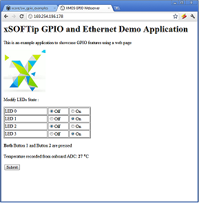

GPIO Ethernet Demo Quickstart Guide
===================================

.. _Slicekit_GPIO_Ethernet_Demo_Quickstart:

sw_gpio_examples GPIO and Ethernet demo : Quick Start Guide
-----------------------------------------------------------

This example demonstrates the use of two Slice Cards, XA-SK-GPIO and XA-SK-E100 together with the xSOFTip components for Ethernet, XTCP, I2C and WebServer to provide access to the GPIO slice features via a simple embedded webserver.

A webpage served from the sliceKIT and accessed in a browser on a host PC has the following demo functions:
   * Turn GPIO Slice Card LEDS on and off
   * Read the room temperature via the onboard ADC and display on the web page
   * Display GPIO Slice Card button press status

Hardware Setup
++++++++++++++

The XP-SKC-L2 Slicekit Core board has four slots with edge conectors: ``SQUARE``, ``CIRCLE``, ``TRIANGLE`` and ``STAR``. 

To setup up the system refer to the figure and instructions below 

   #. Connect the XA-SK-E100 Slice Card to the XP-SKC-L2 Slicekit Core board using the connector marked with the ``CIRCLE``.
   #. Connect the XA-SK-GPIO Slice Card to the XP-SKC-L2 Slicekit Core board using the connector marked with the ``SQUARE``.
   #. Connect the XTAG Adapter to Slicekit Core board, and connect XTAG-2 to the adapter. 
   #. Connect the XTAG-2 to the host PC. Note that an Ethernet cable is not provided with the Slicekit starter kit.
   #. Connect one end of the Ethernet cable to XA-SK-E100 Slice Card and the other end to the RJ45 jack of your host PC.
   #. Switch on the power supply to the Slicekit Core board.
   #. Ensure the activity LEDs on the XA-SK-E100 Slice Card and the host PC's Ethernet Jack are toggling.
   
.. figure:: images/hardware_setup.png
   :align: center

   Hardware Setup for the GPIO and Ethernet Application Demo 

Import and Build the Application
++++++++++++++++++++++++++++++++

   #. Open xTIMEcomposer, then open the edit perspective (Window->Open Perspective->XMOS Edit).
   #. Locate the ``'Slicekit GPIO Ethernet Demo'`` item in the xSOFTip Broswer window and drag it into the Project Explorer window in the xTIMEcomposer. This will also cause the modules on which this application depends (in this case, module_ethernet_board_support, module_i2c_master, module_webserver) to be imported as well. 
   #. Click on the ``Slicekit GPIO Ethernet Demo`` item in the Explorer pane then click on the build icon (hammer) in xTIMEcomposer. Check the console window to verify that the application has built successfully.

For help in using xTIMEcomposer, try the xTIMEcomposer tutorials, which you can find by selecting Help->Tutorials from the xTIMEcomposer menu.

Running the Demo
++++++++++++++++

   #. Click on the ``Run`` icon (the white arrow in the green circle). A dialog will appear asking which device to connect to. Select ``XMOS XTAG2``. 
   #. xTIMEcomposer console displays the ip address obtained by the DHCP client (or local link if DHCP server is not accesible). Please note if the DHCP  server is not available on the host PC, it may take a while to obtain the ip address.
   #. Open a web browser on the host PC and type the ip address displayed on the xTIMEcomposer console into the browser's address bar
   #. On hitting the return key, a web page should get loaded and displayed in the browser as shown in the figure below.

   Screenshot of GPIO web page

Use the web page options to perform various actions such as
   #. Switch on all the LEDS by turning them all to 'ON' in the browser then clicking Submit. The LEDS should light, the ADC temperature display should be updated, and the webpage will report no buttons have been pressed.
   #. Switch off two of the LEDS by turning two to 'OFF' in the browser then clicking Submit. Two LEDS should go out and the ADC temperature is reported again. This time also webpage will report no buttons have been pressed.
   #. Press SW1 button on the GPIO slice card and then press submit. The web page should now report that Button 1 is pressed.
   #. Press SW2 button on the GPIO slice card and then press submit. The web page should now report that Button 2 is pressed.
   #. Just hitting Submit now displays both the buttons are not pressed. LEDs state remain unchanged unless they are explicitly changed on the web page.
    
Next Steps
++++++++++

Look at the Code
................

   #. Examine the application code. In xTIMEcomposer navigate to the ``src`` directory under app_sk_gpio_eth_combo_demo and double click on the main.xc file within it. The file will open in the central editor window.
   #. The channel ``c_gpio`` is used between web page handler and application handler to send web page requests to the application and to collect GPIO status from the application.
   #. In the app_handler.xc file, the API function ``set_gpio_state`` is used by the web page in order to apply web page LED settings and similarly the API function ``get_gpio_state`` is used by the web page to collect the current GPIO status containing LEDs, button presses and ADC temperature values.
   #. There is some GPIO button scan logic which monitors for value changes on the configured 4-bit button port (XS1_PORT_4C) in the application handler routine as defined in the ``app_handler.xc`` file. Whenever this port value changes, the GPIO button states are updated accordingly.
   #. Also verify that that the ADC value is read whenever there is a web page request. This value is interpolated to get a proper temerature value and is updated in the GPIO state structure before sending it to the web page.
   #. As a part of this exercise, modify the IP address settings in main.xc file to a static ip address as in the commented part of ip config, build and run the application. Open a web browser to check whether you are able to open a web page using the new ip address and able to issue LED commands from the web page.

Building web pages for your applications
........................................

This application parses ethernet data to interpret web page commands. Refer to the Programming Guide section within the ``SliceKit GPIO Example Applications`` documentation linked from the front page documentation for this demo for more information on how to utilize the ``Embedded Webserver Function Library`` component in building your own custom web server applications.
