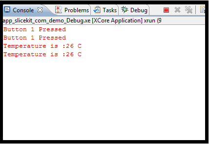

GPIO Simple Demo Quickstart Guide
=================================

.. _Slicekit_GPIO_Simple_Demo_Quickstart:

sw_gpio_examples simple demo : Quick Start Guide
------------------------------------------------

This simple demonstration of xTimeComposer Studio functionality uses the XA-SK-GPIO Slice Card together with the xSOFTip I2C Master component to:

   * communicate with the ADC (and external temperature sensing circuit) on the Slice Card
   * display the temperature value on the xTimeComposer debug console when a button is pressed
   * Cycle through the 4 LEDs on the Slice Card when another button is pressed

Hardware Setup
++++++++++++++

The XP-SKC-L2 Slicekit Core board has four slots with edge conectors: ``SQUARE``, ``CIRCLE``,``TRIANGLE`` and ``STAR``. 

To setup up the system:

   #. Connect XA-SK-GPIO Slice Card to the XP-SKC-L2 Slicekit Core board using the connector marked with the ``SQUARE``.
   #. Connect the XTAG Adapter to Slicekit Core board, and connect XTAG-2 to the adapter. 
   #. Connect the XTAG-2 to host PC. Note that a USB cable is not provided with the Slicekit starter kit.
   #. Switch on the power supply to the Slicekit Core board.

.. figure:: images/hardware_setup.png
   :align: center

   Hardware Setup for Simple GPIO Demo
   
	
Import and Build the Application
++++++++++++++++++++++++++++++++

   #. Open xTimeComposer and open the edit perspective (Window->Open Perspective->XMOS Edit).
   #. Locate the ``'Slicekit Simple GPIO Demo'`` item in the xSOFTip pane on the bottom left of the window and drag it into the Project Explorer window in the xTimeComposer. This will also cause the modules on which this application depends (in this case, module_i2c_master) to be imported as well. 
   #. Click on the app_sk_gpio_simple_demo item in the Explorer pane then click on the build icon (hammer) in xTimeComposer. Check the console window to verify that the application has built successfully.

For help in using xTimeComposer, try the xTimeComposer tutorials, which you can find by selecting Help->Tutorials from the xTimeComposer menu.

Note that the Developer Column in the xTimeComposer on the right hand side of your screen provides information on the xSOFTip components you are using. Select the ``I2C master (Single Bit Ports)``  component in the xSOFTip Browser, and you will see its description together with links to more documentation for this component. Once you have briefly explored this component, you can return to this quickstart guide by re-selecting  ``'Slicekit COM Port GPIO Demo'`` in the xSOFTip Browser and clicking once more on the Quickstart  link for the ``GPIO Simple Demo Quickstart``.
    

Run the Application
+++++++++++++++++++

Now that the application has been compiled, the next step is to run it on the Slicekit Core Board using the tools to load the application over JTAG (via the XTAG2 and Xtag Adaptor card) into the xCORE multicore microcontroller.

   #. Click on the ``Run`` icon (the white arrow in the green circle). A dialog will appear asking which device to cvonnect to. Select ``XMOS XTAG2``. The debug console window in xTIMEcomposer should then display the message ``** WELCOME TO SIMPLE GPIO DEMO  **`` in the Debug Console window. This has been generated from the application code via a call to the ``printstr()`` function. 
   #. Press Button 1 on the GPIO Slice Card. Each time the button is pressed, the application lights the next LEDs on the Slice Card and displays "Button 1 pressed" in the debug console within xTime Composer Studio. Press the button 5 or 6 times to verify the functionality.
   #. Press Button 2 on the Slice Card. This causes the current temperature value to be read from the ADC over the I2C bus and then reported on the debug console. Press the button a few times. 
   #. Do something to alter the temperature of the sensor (use freezer spray, or place your finger on it for a while). Press Button 2 again to verify that the changed temperature is reported.

   Screenshot of Console window
    
Next Steps
++++++++++

Look at the Code
................

   #. Examine the application code. In xTIMEcomposer navigate to the ``src`` directory under app_sk_gpio_simple_demo and double click on the main.xc file within it. The file will open in the central editor window.
   #. Find the main function and note that it runs the app_manager() function on a single logical core. Confirm that there are no other logical cores running (e.g. only one function call within the par{}.
   #. Find the app_manager function within the same file and look at the ``select`` statement within it. What do you think this select statement is doing? Review the XC programming guide (:ref:`prog_xc_responding_to_multiple_inputs`) to find out more about ``select`` statements. Now use the xSOFTip explorer pane to navigate back to the root of the documentation for this application. Click on the 'Slicekit GPIO Example Applications and read the notes there about how the code works.
   #. Examine the I2C interface to the ADC on the Slice Card. Take a look at the calls to the I2C Master function library within main.xc, and use the xSOFTip Explorer pane in xTIMEcomposer to locate this module and display its documentation in the Developer Column.

Try the Com Port Demo
.....................

   #. If you have a PC with a physical COM port, or a USB to Serial Uart cable you can run the extended version of this application (app_sk_gpio_com_demo) which adds a UART to the application and allows the SliceCard and its buttons, LEDs and ADC to be controlled and interrogated from a serial terminal console on a host PC. Follow the link to the quickstart guide for this application for further information on running this extended demo:

:ref:`Slicekit_GPIO_COM_port_Demo_Quickstart`
   
