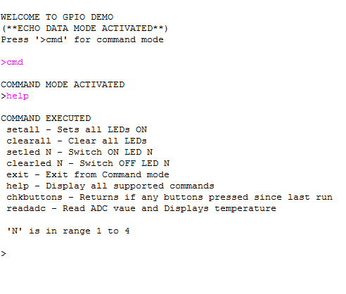

sw_gpio_examples COM demo : Quick Start Guide
--------------------------------------------------

We use the XA-SK-GPIO Slice Card together with the xSOFTip UART to create a UART , and send data to and from a PC COM port. 
Also xSOFTip I2C software component to communicate with on board ADC. 
This application showcases some of the key software features and serves as an example on how to use APIs of UART and I2C. 
This demo features UART data loop back, receives commands from comport, and perform according to the command input.

Hardware Setup
+++++++++++++++

   The XP-SKC-L2 Slicekit Core board has four slots "SLOT SQUARE", "SLOT CIRCLE","SLOT TRIANGLE" and "SLOT STAR". 
   The XA-SK-GPIO Slice Card have Four LED's, Thermistor, Two Push Button Switches and an ADC.

   Details of slice kit modular system and slices are availaible in the following link,
   https://github.com/xmos/hw_slicekit_system.git.

   #. Connect XA-SK-GPIO Slice Card to the XP-SKC-L2 Slicekit Core board. This Slice Card can be connected to either ``Square``, ``Tringle``, ``Circle`` or ``Star`` connector of Slicekit Core board, but for now, use the SQUARE slot as shown in the figure above
   #. Connect Serial cable (provided with XA-SK-GPIO Slice Card package) to DB-9 connector on XA-SK-GPIO Slice Card.
   #. Connect other end of cable to Host DB-9 connector slot (or) USB cable (if using USB to UART cable).
   #. Identify serial port number provided by the Host and open a suitable terminal software for the selected serial port (refer to the Hercules or SecureCRT documentation above) for default parameters which are as follows: 115200 baud, 8 bit character length, even parity config, 1 stop bit and no hardware flow control  
   #. Connect the XTAG Adapter to Slicekit Core board, Chain connector(xtag slice) and connect XTAG-2 to the adapter. 
   #. Connect the XTAG-2 to host PC or Mac USB port.
   #. Switch on the power supply to the Slicekit Core board.

.. figure:: images/hardware_setup.png
   :align: center

   Hardware Setup for GPIO Demo
   
Software Configuration
++++++++++++++++++++++

    The following defines should be made according to the connection of the GPIO slice card to the core board in "main.xc" file:

    * #define SK_GPIO_SLOT_SQUARE 1  - connect the GPIO slice card to the SLOT SQUARE of core baoard.
    * #define SK_GPIO_SLOT_CIRCLE 1  - connect the GPIO slice card to the SLOT CIRCLE of core baoard.
    * #define SK_GPIO_SLOT_TRIANGLE 1  - connect the GPIO slice card to the TRIANGLE of core baoard.
    * #define SK_GPIO_SLOT_STAR 1  - connect the GPIO slice card to the SLOT STAR of core baoard.
    
   #. Define AD7995_0 in module_i2c_master (#define AD7995_0)
 
 	
Build the Application
+++++++++++++++++++++

The following components are required to build ``app_slicekit_com_demo`` application:
    
    * sc_i2c:  https://github.com/xcore/sc_i2c.git
    * sc_uart: https://github.com/xcore/sc_uart.git

   #. Clone the above repositroes or download them as zipfile packages.
   #. Open the XDE (XMOS Development Tools - latest version as of this writing is 11.11.1) and Choose `File` |submenu| `Import`.
   #. Choose `General` |submenu| `Existing Projects into Workspace` and click **Next**.
   #. Click **Browse** next to `Select archive file` and select a component ZIP file.
   #. Select module_i2c_master from sc_i2c and module_uart_tx, module_uart_rx modules from sc_uart.
   #. Click **Finish**.
   #. Repeat the import process for the remaining zipfiles.
   #. To build, select `app_slicekit_com_demo` from `sw_gpio_examples` folder in the Project Explorer pane and click the **Build** icon.   

Install Demonstration Tools on the Host PC
++++++++++++++++++++++++++++++++++++++++++

The following tools should be installed on the host system in order to run this application

    * For Win 7: Hercules Setup Utility by HW-Group
      http://www.hw-group.com/products/hercules/index_en.html
    * For MAC users: SecureCRT7.0 
      http://www.vandyke.com/download/securecrt/
    
   #. *Note:* Make sure to change the settings of the tool as CR/LF line end characters. 
      In Secure CRT 'Newline mode' should be selected in the settings.

Usage of Software
+++++++++++++++++

   #. Open the XDE
   #. Choose *Run* |submenu| *Run Configurations*
   #. Double-click *XCore Application* to create a new configuration
   #. In the *Project* field, browse for `app_slicekit_com_demo`
   #. In the *C/C++ Application* field, browse for the compiled XE file
   #. Select the *XTAG-2* device in the `Target:` adapter list
   #. Click **Run**

Demo Application
+++++++++++++++++

   #. Select and Open the configured terminal client application console on the Host.
   #. The terminal displays the following message "WELCOME TO GPIO DEMO (**ECHO DATA MODE ACTIVATED**) Press '>cmd' for command mode
      In this mode any character typed in from the key board is echoed back.

   Screenshot of Hyperterminal window

   #. LED cycles up on each button press of Button 1 in the ECHO DATA MODE and Message "Button 1 is Pressed" is displayed in the XDE Console.
   #. Displays Temperature value in the XDE Console up on the Press of Button 2.
   #. Type in >cmd for command mode.
   #. Type in help for list of supported commands.
   #. Type in setall for switching ON all the LEDs.
   #. Type in clearall for switching OFF all the LEDs.
   #. Type in setled N for switching ON a particular LED. 'N' ranges from 1 to 4.
   #. Type in clearled N for switching OFF a particular LED. 'N' ranges from 1 to 4.
   #. Type in chkbuttons for returning status of buttons since last 'chkbuttons' command.
   #. Type in readadc for readig ADC value and displaying current temperature.
   #. Type in exit for exiting command mode and go back to ECHO DATA MODE.
   
  
    
Next Steps
++++++++++

   #. Refer to the module_i2c_master, module_uart_tx and module_uart_rx documentation 
   	for implementation details of this application and information on further things to try.
   
