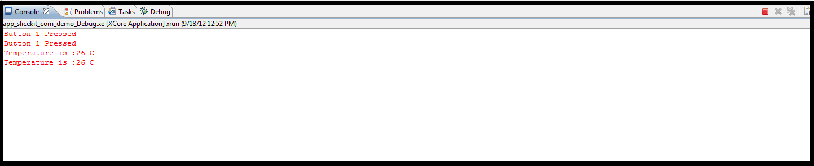

sw_gpio_examples simple demo : Quick Start Guide
------------------------------------------------

This simple demonstration of basic XCore processor and xTimeComposer Studio functionality uses the XA-SK-GPIO Slice Card together with the xSOFTip I2C Master component to:

   * communicate with the ADC (and external temperature sensing circuit) on the Slice Card
   * display the temperature value on the xTimeComposer debug console when a button is pressed
   * Cycle through the 4 LEDs on the Slice Card when another button is pressed

Hardware Setup
++++++++++++++++++

The XP-SKC-L2 Slicekit Core board has four slots with edge conectors: ``SQUARE``, ``CIRCLE``,``TRIANGLE`` and ``STAR``. 

To setup up the system:

   #. Connect XA-SK-GPIO Slice Card to the XP-SKC-L2 Slicekit Core board using the connector marked with the SQUARE.
   #. Connect the XTAG Adapter to Slicekit Core board, and connect XTAG-2 to the adapter. 
   #. Connect the XTAG-2 to host PC via the provided USB cable.
   #. Switch on the power supply to the Slicekit Core board.

.. figure:: images/hardware_setup.png
   :align: center

   Hardware Setup for Simple GPIO Demo
   
Software Configuration
++++++++++++++++++++++
        
   #. Define AD7995_0 in module_i2c_master (#define AD7995_0)
	
Import and Build the Application
+++++++++++++++++++++

   #. Open xTimeComposer and check that it is operating in online mode
   #. Locate the following items in the xSOFTip pane on the bottom left of the window:
      * app_slicekit_simple_demo
      * I2C
      * UART
   #. Import all three
   #. Click on app simple in the Explorer pane then click on the build icon (hammer) in the foo window. Check the console window to verify that the application has built successfully.

Use the Software
++++++++++++++++

   #. Open the XDE
   #. Choose *Run* |submenu| *Run Configurations*
   #. Double-click *XCore Application* to create a new configuration
   #. In the *Project* field, browse for `app_slicekit_com_demo`
   #. In the *C/C++ Application* field, browse for the compiled XE file
   #. Select the *XTAG-2* device in the `Target:` adapter list
   #. Click **Run**

Demo Application
++++++++++++++++

   #. Pressing Button 1 on the Slice Card cycles through the Slice Card LEDs and displays "Button 1 pressed" in the debug console within xTime Composer Studio. Press the button 5 or 6 times to verify the functionality.
   #. Pressing Button 2 displays current temperature value on the console. Press the button a few times. The current temperature is then displayed in the debug console. 
   #. Do something to alter the temperature of the sensor (use freezer spray, or place your finger on it for a while). Press Button 2 again to verify that the changed temperature is reported.
   

   Screenshot of Console window
    
Next Steps
++++++++++

   #. Examine the application code. In xTimeCOposer:
      #. Foo
      #. Bar
   #. If you have the USB to Serial cable reccomended for use with this SliceCard (FIXME: add link) you can run the extended version of this application which adds a UART to the application and allows the SliceCard to be controlled from a serial terminal console on a host PC.
   #. 
   
