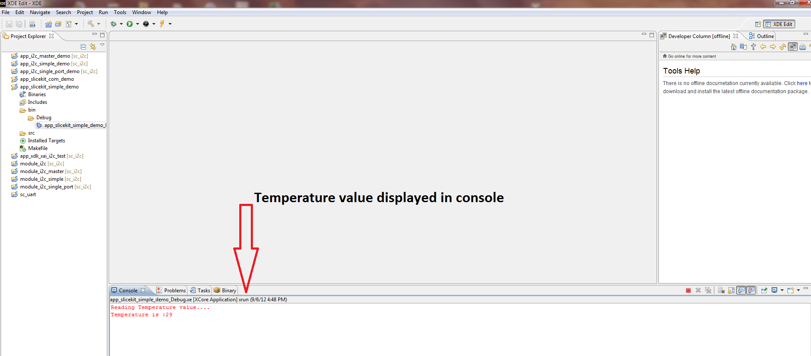

sw_gpio_examples simple demo : Quick Start Guide
--------------------------------------------------

We use the XA-SK-GPIO GPIO Slice Card together with the I2C software component to communicate with on board ADC. 
This application showcases some of the software key features and serves as an example on how to use API of I2C. 
This demo features cycles on baord LEDs by Button press and displays current temperature value on Button press.

Software Configuration
++++++++++++++++++++++

The following defines should be made according to the connection of the 
GPIO slice acard to the core board:
    
    * #define SK_GPIO_SLOT_SQUARE  - connect the GPIO slice card to the SLOT SQUARE of core baoard.
    * #define SK_GPIO_SLOT_CIRCLE  - connect the GPIO slice card to the SLOT CIRCLE of core baoard.
    * #define SK_GPIO_SLOT_TRIANGLE  - connect the GPIO slice card to the TRIANGLE of core baoard.
    * #define SK_GPIO_SLOT_STAR  - connect the GPIO slice card to the SLOT STAR of core baoard.
    
   #. Define AD7995_0 in module_i2c_master (#define AD7995_0)
	
Build the Application
+++++++++++++++++++++

The following components are required to build ``app_slicekit_simple_demo`` application:
    
    * sc_i2c:  https://github.com/xcore/sc_i2c.git
    * xcommon: https://github.com/xcore/xcommon.git (Optional)

   #. Clone the above repositroes or download them as zipfile packages.
   #. Open the XDE (XMOS Development Tools - latest version as of this writing is 11.11.1) and Choose `File` |submenu| `Import`.
   #. Choose `General` |submenu| `Existing Projects into Workspace` and click **Next**.
   #. Click **Browse** next to `Select archive file` and select the first firmware ZIP file.
   #. Click **Finish**.
   #. Repeat the import process for the remaining zipfiles.
   #. To build, select `app_slicekit_com_demo` from `sw_gpio_examples` folder in the Project Explorer pane and click the **Build** icon.   

Set Up The Hardare
++++++++++++++++++

   [**FIXME: To add a subsection listing the hardware required, with links to their product pages on XMOS.com]

.. figure:: images/hardware_setup.png
   :align: center

   Demonstration Hardware Setup

   #. Connect XA-SK-GPIO Slice Card to the XP-SKC-L2 Slicekit Core board. 
      This Slice Card can be connected to either ``Square``, ``Tringle`` or ``Star`` connector of Slicekit Core board, 
      but for now, use the TRIANGLE slot as shown in the figure above
   #. Connect the XTAG Adapter to Slicekit Core board, Chain connector and connect XTAG-2 to the adapter. 
   #. Connect the XTAG-2 to host PC or Mac USB port.
   #. Switch on the power supply to the Slicekit Core board.

Use the Software
++++++++++++++++

   #. Open the XDE
   #. Choose *Run* |submenu| *Run Configurations*
   #. Double-click *XCore Application* to create a new configuration
   #. In the *Project* field, browse for `app_slicekit_com_demo`
   #. In the *C/C++ Application* field, browse for the compiled XE file
   #. Ensure the *XTAG-2* device is selected in the `Target:` adapter list
   #. Click **Run**

Do the Demo
+++++++++++

   #. Pressing Button 1 cycles on board LEDs and displays Button pressed on the console.
   #. Pressing Button 2 displays current temperature value on the console.
   

   Screenshot of Console window
    
Next Steps
++++++++++

   #. Refer to the module_i2c_master documentation for implementation details of this application and information on further things to try.
   
