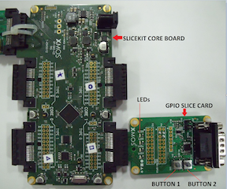
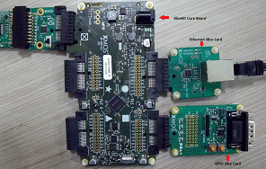

Evaluation Platforms
====================

Recommended Hardware
--------------------

This application may be evaluated using the Slicekit Modular Development Platform, available from digikey. Required board SKUs are:

   * XP-SKC-L2 (Slicekit L2 Core Board) plus XA-SK-GPIO plus XA-SK-XTAG2 (Slicekit XTAG adaptor) plus XTAG2 (debug adaptor)

Example Applications
--------------------

app_slicekit_simple_demo
++++++++++++++++++++++++

This application has the following features:

   * module_i2c_master from the xSOFt ip library is used to access the external ADC, which is equipped with an external linearised thermistor circuit for temperature sensing.
   * simple code to print the recorded temperature to the XDE debug console on the press of one of the Slice Card buttons
   * simple code to cycle through the 4 LEDs each time the other button is pressed.
   * demonstrates use of XC select statements for handling multiple concurrent inputs
   * demonstrates basic usage of XCore ports

    Hardware Setup for Simple Demo

app_slicekit_com_demo
+++++++++++++++++++++

This application extends the simple demo to provide the following functionality (all options are dynamically reconfigurable via the APIs for app_slicekit_com_demo application):

   * Uart RX and TX Using the generic Uart RX and TX xSOFTip components
      * Baud Rate: 150 to 115200 bps
      * Parity: None, Mark, Space, Odd, Even
      * Stop Bits: 1,2
      * Data Length: 1 to 30 bits (Max 30 bits assumes 1 stop bit and no parity)
   * Cycles Through LEDs on button Press
   * Displays temperature value and button press events on the terminal console of a host PC via the UART

    Hardware Setup for COM Port UART Demo

app_sk_gpio_eth_combo_demo
++++++++++++++++++++++++++

   * XA-SK-E100 Ethernet Slice Card is additionally required for this demo

This application extends the GPIO com port demo to utilize Ethernet and XTCP components in order to host a web page to

   * Turn GPIO Slice Card LEDs on and off
   * Display GPIO Slice Card button press status
   * Read the room temperature via the onboard ADC and display on the web page

    Hardware Setup for GPIO Ethernet combo Demo

app_sk_gpio_wifi_tiwisl_combo_demo
++++++++++++++++++++++++++++++++++

   * XA-SK-WIFI Slice Card is additionally required for this demo

This application extends the GPIO com port demo to utilize Wi-Fi component in order to host a web page to

   * Turn GPIO Slice Card LEDs on and off
   * Display GPIO Slice Card button press status
   * Read the room temperature via the on-board ADC and display on the web page

.. image:: images/gpio_wifi_tiwisl_combo_hardware_setup.png
    :align: left

    Hardware Setup for GPIO Wi-Fi combo Demo
    