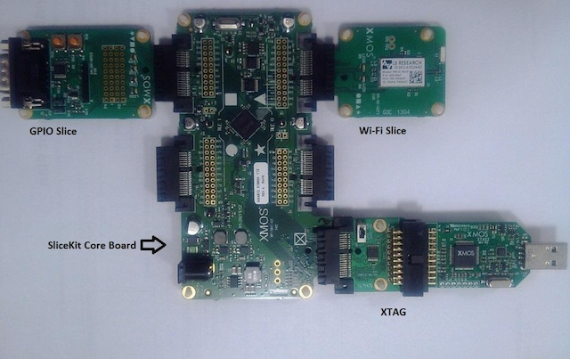

Evaluation Platforms
====================

Recommended Hardware
--------------------

This application may be evaluated using the sliceKIT platform, available from digikey. Required units are:

   * XP-SKC-L16 (sliceKIT L16 core board) plus XA-SK-GPIO plus XA-SK-XTAG2 (sliceKIT XTAG-2 adaptor) plus XTAG-2 (debug adaptor)

Example Applications
--------------------

app_slicekit_simple_demo
++++++++++++++++++++++++

This application has the following features:

   * module_i2c_master from the xSOFTip library is used to access the external ADC, which is equipped with an external linearised thermistor circuit for temperature sensing.
   * simple code to print the recorded temperature to the xTIMEcomposer debug console on the press of one of the sliceCARD buttons
   * simple code to cycle through the 4 LEDs each time the other button is pressed.
   * demonstrates use of XC select statements for handling multiple concurrent inputs
   * demonstrates basic usage of xCORE ports

.. figure:: images/hardware_setup.png
    :align: center

    Hardware setup for simple demo

app_slicekit_com_demo
+++++++++++++++++++++

This application extends the simple demo to provide the following functionality (all options are dynamically reconfigurable via the APIs for app_slicekit_com_demo application):

   * Uart RX and TX Using the generic Uart RX and TX xSOFTip components
      * Baud Rate: 150 to 115200 bps
      * Parity: None, Mark, Space, Odd, Even
      * Stop Bits: 1,2
      * Data Length: 1 to 30 bits (Max 30 bits assumes 1 stop bit and no parity)
   * Cycles through LEDs on button Press
   * Displays temperature value and button press events on the terminal console of a host PC via the UART

.. figure:: images/hardware_setup.png
    :align: left

    Hardware setup for com port uart demo

app_sk_gpio_eth_combo_demo
++++++++++++++++++++++++++

   * XA-SK-E100 ethernet sliceCARD is additionally required for this demo

This application extends the gpio com port demo to utilize ethernet and xtcp components in order to host a web page to

   * Turn GPIO sliceCARD LEDs on and off
   * Display GPIO sliceCARD button press status
   * Read the room temperature via the onboard ADC and display on the web page

.. figure:: images/gpio_eth_combo_hardware_setup.*
    :align: left

    Hardware setup for gpio ethernet combo demo

app_sk_gpio_wifi_tiwisl_combo_demo
++++++++++++++++++++++++++++++++++

   * XA-SK-WIFI sliceCARD is additionally required for this demo

This application extends the gpio com port demo to utilize Wi-Fi component in order to host a web page to

   * Turn GPIO sliceCARD LEDs on and off
   * Display GPIO sliceCARD button press status
   * Read the room temperature via the on-board ADC and display on the web page

    Hardware setup for gpio wi-fi combo demo
    
